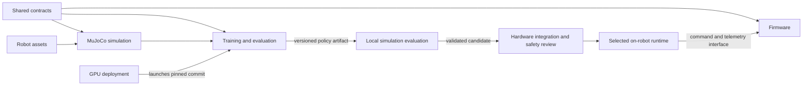

# CAMEL

**Controlled Active-Suspension Mobility for Extreme Landscapes** is the ME 481/482 capstone project of Group 40 (Fall 2026 registration). The team is developing an all-terrain mobile platform intended to combine efficient wheeled travel with active adaptation to uneven ground. A specific use case and measurable performance targets are still to be selected with the external partner.

The team's [GitHub repository](https://github.com/Yulaiduan/WATERLOO-MTE-ME-CAPSTONE) is the shared home for documentation and engineering code. It is currently **public**; include only material approved for public sharing.

## Team quickstart: push to main

**Teammates with write access work on `main` and push directly. No branch or PR
is required.** Pull the latest `main` before editing, coordinate shared files,
append the contribution log and run the applicable checks before pushing.
If someone pushes first, integrate their changes, preserve both contributions
and rerun checks. Optional branches/PRs remain available for work that benefits
from review; contributors without write access use a fork and PR.

- Personal tools and experiments: `users/<member>/experimental-apps/<app>/`.
- Shared ChatGPT/Codex handoffs: `context/users/<member>/`.
- Team engineering code and accepted records: their existing component folders.

The [team registry](database/md_research/team.md) lists member folders.
[Contribution instructions](CONTRIBUTING.md) explain validation and coordination.
Local hooks validate before pushing; CI checks every push, including `main`.
GitHub blocks force pushes and deletion of `main`. CI failures are visible after
publication, so resolve them promptly; CI is not a required pre-publication gate.

## Save useful ChatGPT context to this repository

**Recommended workflow: summarize in the original ChatGPT chat, then import
through Codex and push directly to `main`.** This lets the chat preserve the discussion's
reasoning while Codex checks the repository's files and contribution rules.

1. In the regular ChatGPT conversation containing the useful work, use the export
   prompt below. Review the Markdown for accuracy and public-sharing suitability.
2. Give the exported Markdown to Codex with the import prompt below. Replace
   `<member-slug>` with your name from [the team registry](database/md_research/team.md)
   (for example, `andy-zhang`).
3. Publish a dated handoff under `context/users/<member-slug>/` directly to `main`
   after validation. App-specific model/setup context belongs with the relevant
   `users/<member-slug>/experimental-apps/<app>/context/`.
4. Other members pull the published files and have Codex read them, or attach the
   relevant files to their ChatGPT conversations. Include the summary itself;
   a chat link alone may be inaccessible to another member.

See the [handoff template](context/templates/chat-handoff.md) and
[full sharing workflow](context/README.md).

### Prompt 1 — export from the original ChatGPT chat

```text
Extract the reusable engineering context from this conversation for
Yulaiduan/WATERLOO-MTE-ME-CAPSTONE.

Member: <member-slug>
Topic: <topic>
Destination: context/users/<member-slug>/YYYY-MM-DD-chatgpt-<topic>.md

Produce a self-contained Markdown handoff covering:
- Goal and relevant constraints.
- Findings and proposed decisions, with reasoning.
- Important equations, values, units and assumptions.
- Alternatives considered, failed approaches and why.
- Sources and links supporting the findings.
- Uncertainties, unresolved disagreements and next steps.

Separate facts, assumptions, proposals and verified results.
Do not mark a decision as team-approved without evidence.
Preserve enough detail for another teammate or Codex to continue without
access to this chat. Exclude unrelated conversation and private information.
Use the actual date; mark unavailable information as unknown.

Return the Markdown in one code block, or as a downloadable .md file.
```

### Prompt 2 — import the handoff through Codex

```text
Import the handoff below into
Yulaiduan/WATERLOO-MTE-ME-CAPSTONE.

Follow AGENTS.md. Start from up-to-date main and preserve unrelated work.
Save the dated handoff under context/users/<member-slug>/ and link it
from my context README. Add a numeric suffix if that filename already exists.

If it concerns a particular experimental app, place its detailed model/setup
context with that app and link it from my general handoff.

Preserve existing context, distinguish proposals from accepted requirements,
append the contribution log, run the required checks, and push directly to main.
Integrate concurrent changes and rerun checks if main has moved. No PR is needed.

[Paste handoff here]
```

### Can a regular web chat save directly by naming this repo?

You can name `Yulaiduan/WATERLOO-MTE-ME-CAPSTONE` in a prompt, but the name or
URL alone grants no repository access or write permission. Direct publishing
depends on connected GitHub tools that support writes, your repository access,
and the tools available to that chat. If those tools are available, explicitly
request a validated direct update to main, and verify the applicable checks run. Otherwise,
export Markdown and use the Codex import workflow above. A summary is shared
knowledge; it does not automatically synchronize private chats or account memories.

Product guidance checked 2026-10-08: [OpenAI plugin permissions](https://learn.chatgpt.com/docs/plugins)
and [projects and chat context](https://learn.chatgpt.com/docs/projects).

## Repository architecture

Use **one repository with separate components**. One commit can capture compatible code, interfaces, robot assets, and documentation, while each component keeps its own dependencies and run instructions. Documentation contributors do not need a firmware compiler or GPU environment.

**Agent entry point:** every agent follows [AGENTS.md](AGENTS.md), reads the [knowledge database](database/README.md) and [shared procedures](agent_skills/README.md), and appends the [contribution log](ENTRY_TEMPLATE.md). Direct pushes and checks are independent of agent vendor or tool. `CLAUDE.md` is only a compatibility pointer.

**Implementation status:** the entry protocol, local hooks, structural checks and CPU physics validator are implemented. Physics remains blocked until a reviewed canonical robot and mass/joint baseline are supplied. Teammates push directly to `main`; CI runs architecture/physics checks after publication. Critical changes retain human review as a team procedure, which can be completed without a PR. [Live rules](https://github.com/Yulaiduan/WATERLOO-MTE-ME-CAPSTONE/rules) protect `main` from force pushes and deletion. Existing local MuJoCo work will be imported separately after review; firmware, training, GPU deployment and hardware runtime choices remain open.

```text
WATERLOO-MTE-ME-CAPSTONE/
├── README.md                 Project overview and repository architecture
├── CONTRIBUTING.md           Branches, reviews and Markdown conventions
├── AGENTS.md                 Shared entry instructions for every agent
├── CLAUDE.md                 Compatibility pointer to AGENTS.md
├── ENTRY_TEMPLATE.md         Template and append-only contribution summaries
├── database/                 Compact agent knowledge: research, LaTeX, prototypes
├── context/                  Shared orientation and member ChatGPT/Codex handoffs
├── users/                    Member experimental apps with app-local context
├── agent_skills/             Shared physics, ingestion and Git procedures
├── tools/                    Entry validator, hook runner and regression tests
├── .githooks/                Local staged-commit and exact-push checks
├── docs/                     Team Markdown: design, meetings, decisions, evidence
├── firmware/                 Embedded control, sensors, drivers, hardware tests
├── simulation/               Local MuJoCo environments, viewers and experiments
├── training/                 Learning algorithms, rewards, configs and evaluation
├── deploy/                   GPU images, job submission and artifact transfer
├── shared/                   Versioned contracts and portable shared utilities
├── assets/                   Canonical robot models, meshes and parameters
└── .github/                  CODEOWNERS, PR template and automated checks
```

| Area | Owns | Shared connections |
| --- | --- | --- |
| [docs](docs/README.md) | Markdown explanations, requirements, meetings, decisions and selected results | Links to every component and its evidence |
| [firmware](firmware/README.md) | Board code, drivers, real-time control, command limits and watchdogs | Implements shared command/telemetry contracts; builds without Python or cloud dependencies |
| [simulation](simulation/README.md) | MuJoCo runtime, local viewer, environment API and experiments | Uses canonical assets and contracts; exposes its environment to training |
| [training](training/README.md) | Algorithms, rewards, configs, evaluation and policy export | Uses the simulation API, assets and shared policy/observation/action contracts |
| [deploy](deploy/README.md) | GPU environment images, job scripts, storage and launch config | Launches the same training entry point at a pinned repository commit |
| [shared](shared/README.md) | Language-neutral schemas, units, conventions and portable utilities | Used by multiple components; never imports board, simulator or cloud-specific code |
| [assets](assets/README.md) | Reusable robot models, meshes and physical parameters | One canonical source for simulation and training, with explicit exports where hardware needs them |

### How the components connect

Arrows show dependency or artifact flow, not direct network connections:



- **Local simulation:** debug and visualize on a laptop without cloud tooling. Training consumes the environment API rather than keeping another simulator copy.
- **GPU training:** deployment selects a commit, config, seed, assets and dependency/image versions, then launches training. GPU availability alone does not make ordinary MuJoCo physics GPU-accelerated; select and validate any accelerated backend separately.
- **Firmware integration:** inference may run on a companion computer or another selected runtime; microcontroller inference is not assumed. Firmware independently enforces command limits, watchdogs, and safe handling of missing or invalid commands.
- **Shared interfaces:** specify observation/action ordering and shapes, SI units, coordinate frames, joint names, timestamps, limits, control frequency, command/telemetry schemas and a compatibility version. Python and embedded code can implement the same contract without sharing a runtime.
- **Policy handoff:** export weights with the code commit, assets revision, interface version, normalization, action scaling, frequency, seed and training config. Validate compatibility and evaluate in simulation before a separately reviewed hardware test.

Each component owns its dependency manifest, lockfile where supported, tests and verified instructions. Package reusable Python code when implemented; avoid absolute developer-specific paths and copied source. A shared interface change must update affected consumers and tests in the same contribution, or include an explicit backwards-compatible migration.

### Multiple contributors: Markdown and code

Use `main` for normal team work and push validated changes directly. Each member has a `users/<member>/` workspace, listed in [the team registry](database/md_research/team.md), plus shared context under `context/users/<member>/`. Organize team code and accepted records by topic or subsystem. Personal/topic branches are optional for concurrent or longer work; integrate current `main` before publication and coordinate changes to shared files.

### Share chat context and experimental apps

Use [context](context/README.md) to share selected regular ChatGPT and Codex
conversation summaries across members, with [a small start packet](context/start-here.md)
and dated, sourced handoffs in `context/users/<member>/`. ChatGPT consumes attached
or connected files; Codex reads the checkout. These are versioned shared files,
not automatic synchronization of private chats or account memories.

Develop personal simulation sandboxes and toolkits under
[users](users/README.md): `users/<member>/experimental-apps/<app>/`. Each app keeps
its own README, dependencies, focused AGENTS.md and model/setup/handoff context.
Canonical components and existing research stay in place. Only Markdown context
and scaffolds qualify for preliminary validation; executable apps retain the
existing physics gate. Promote validated team tools into their owning component
with an explicit migration.

| Contribution | Destination |
| --- | --- |
| Living design explanation or calculation | `docs/design/<subsystem>/<topic>.md` or `<topic>/README.md` |
| Meeting notes | `docs/meetings/YYYY-MM-DD-topic.md` |
| Decision with status and rationale | `docs/decisions/NNNN-short-title.md` |
| Reproducible engineering result | `docs/benchmarks/YYYY-MM-DD-topic/README.md` plus small selected evidence |
| A topic's figures | Its adjacent `assets/` folder |
| Component build/run instructions | That component's `README.md` |

Create deeper folders as content arrives. Add authors, date, status, assumptions and sources to substantive notes. Update existing topics instead of creating competing copies, and link new pages from `docs/README.md`. Coordinate edits to the same section and preserve both contributors' meaning when resolving conflicts. See [contribution instructions](CONTRIBUTING.md).

### Artifacts and GitHub checks

Commit Markdown, source, small configs, schemas and manageable text robot models. Keep raw runs, checkpoints, datasets, videos and large generated meshes in team-approved artifact storage; commit compact summaries and reproducibility manifests. Use Git LFS for selected large source assets only after configuring it. Credentials and local environments stay out of Git.

Planned checks are scoped by changed paths: Markdown links for docs, embedded build/tests for firmware, headless smoke tests for simulation, CPU smoke tests for training, and image/config checks for deployment. Changes to `shared/` or `assets/` also exercise affected consumers. Full GPU jobs require explicit launch and runtime/cost limits, rather than running on every pull request.

**Shared contribution gate:** run the applicable checks locally before pushing; `Entry architecture` and `Headless physics` also run after every push to `main`. No PR or required GitHub status-check barrier is configured. Routine work needs no teammate approval. Canonical assets, shared interfaces, checks and agent rules retain human review, with owner authorization/review for enforcement changes; an explicit owner request can authorize the policy change without requiring a separate author or PR. This critical-path review is a team procedure, not path-specific GitHub enforcement. The validation gate permits [preliminary research](agent_skills/preliminary_research.md) before an approved robot exists, with explicit assumptions and research checks. Executable robot, asset, dependency and mixed changes still require canonical physics validation. Confirmed specialist assignments, the canonical robot, GPU runners and artifact storage remain open. See the [rollout record](database/md_research/entry-protocol.md).

### Bring existing work into this layout

1. Import reviewed local docs under `docs/` and MuJoCo code under `simulation/`, preserving links and verified launch paths.
2. Extract genuinely reused robot assets into `assets/` and contracts into `shared/`; update consumers together and rerun simulation checks.
3. Add the chosen firmware toolchain and a minimal repeatable training/evaluation entry point with separate dependencies.
4. Add the GPU launch environment after the training entry point runs locally; record backend, versions, output storage and cleanup procedures.

Do not blindly copy local environments, generated results or private partner material during import. Component READMEs must distinguish planned work from verified commands.

## Proposed design

The registration concept is a four-wheel-drive, low-degree-of-freedom quadruped with four independently actuated, spring-assisted wheeled legs. Each leg's upper and lower sections are mechanically coupled so the leg operates with one degree of freedom. Motors mounted on the chassis reduce unsprung mass; two additional motors drive the left and right wheel pairs for steering. The intended capabilities are active chassis levelling, obstacle clearance, and terrain adaptability. This is a **preliminary concept**, not a frozen design.

## Team

| Member | Registered focus |
| --- | --- |
| Ali Muizz | Gearbox and transmission design |
| Andy Zhang | Motor and chassis design |
| Jonathan Xie | Electronics and kinematic analysis |
| Yulai Duan | Controls, thermal modelling, and simulations |
| Jiaan Li | Structure design and integration |

The team is working with an external partner providing funding and guidance. The registration form does not name the partner. A faculty advisor was not confirmed in the form.

## Verification approach

The team plans to agree on measurable size, mass, speed, payload, and terrain-performance requirements with the partner. Hand calculations, analysis, and simulation will inform the design; a scaled proof of concept will precede a full-scale functional prototype. Final tests should compare the prototype with the agreed requirements. Test methods and pass/fail thresholds have not yet been documented.

## Current documentation

For training inputs, see [terrain specifications and proposed training/evaluation plan](docs/design/simulation/terrain-training-spec.md), based on the team's Notion Specs page. It preserves 11 representative terrain envelopes and separates suggested values from missing parameters and accepted requirements.

Start with the [documentation map](docs/README.md). It separates the [preliminary physical system architecture](docs/architecture.md) from the repository architecture above and the [setup checklist](docs/setup.md). Local MuJoCo work exists separately; hardware and GPU training/deployment choices remain open.

## Items to confirm

- Specific use case, users, operating environment, and constraints.
- Faculty advisor, partner identity and sharing/confidentiality rules.
- Requirements, target values, test conditions, and acceptance criteria.
- Final subsystem interfaces, components, tools, budget, and schedule.
- Instructor feedback and approval. The approval boxes in the supplied registration form are blank.

**Source:** *ME 481 - Fall 2026 Design Project Registration Form*, pages 2-3, supplied as `Project Registration Form.docx.pdf`. Statements above describe the team's submitted proposal, not instructor approval or independently verified market claims.
