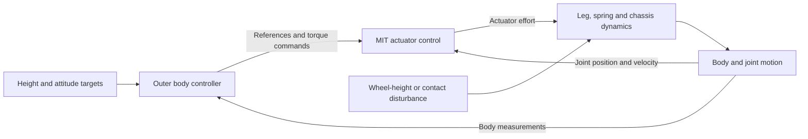

# Robot controls — Andy's context overview

- Author: Andy Zhang, synthesized with ChatGPT.
- Updated: 2026-10-10 (America/Toronto).
- Source tool: ChatGPT; available Capstone-project excerpts, targeted conversation retrieval and linked repository records.
- Status: exploratory context and open questions; no new team-approved control architecture or hardware result.
- Scope: the Capstone spring-assisted wheeled robot and its suspension controls.
- Repository revision reviewed: `7c5cbc76efd36876e829803efc49578bea24f7fa` on `main`; this packet's publication revision is in Git history.
- Supersedes: none. Earlier handoffs and app-specific records retain their scope.

## The idea in one paragraph

Andy is exploring how to control a wheeled robot with mechanically coupled legs, physical spring assistance and active actuators. His immediate focus is connecting familiar PID and mass–spring–damper models to an actuator running MIT-style impedance control, then understanding what an outer chassis controller should command. He wants every block to have a clear physical meaning, equation, input and output, with both a detailed mathematical diagram and a simpler system-level view. The recurring questions concern the plant seen at each loop boundary, how passive and virtual stiffness combine, which layer handles oscillations, how geometry converts joint torque into support force, and what simulation and hardware are sufficient to test those ideas. This is a record of the exploration, including unresolved alternatives. [Sources S01–S12](2026-10-10-chatgpt-controls-sources.md#project-conversation-excerpts)

## Read this packet by purpose

| Note | What it preserves |
| --- | --- |
| [Explored topics](2026-10-10-chatgpt-controls-topics.md) | Questions Andy asked, alternatives discussed and the distinctions that matter |
| [Open questions](2026-10-10-chatgpt-controls-open-questions.md) | High-level floating problems, why they matter and what would resolve them |
| [Modeling reference](2026-10-10-chatgpt-controls-model-reference.md) | A compact, explicitly illustrative set of variables and equations for continuing the discussion |
| [Conversation and source map](2026-10-10-chatgpt-controls-sources.md) | Dates/titles, coverage limits, retrieved earlier context and authoritative repository links |

## What is established at each level

| Item | Current status and meaning |
| --- | --- |
| Four spring-assisted wheeled legs, coupled upper/lower links, two left/right wheel-pair drives | **Project proposal.** This suggests four suspension actuators plus two drive actuators; it is not a count of every mechanical degree of freedom. See [shared architecture](../../../docs/architecture.md). |
| A fixed large pulley, driven upper link and knee-opening spring | **Mechanism described in the Oct 6 controls discussion.** Useful historical context; actual routing, coordinates and current spring attachment must come from the selected model/CAD. [S06](2026-10-10-chatgpt-controls-sources.md#project-conversation-excerpts) |
| Outer body controller plus local MIT impedance | **Architecture being explored.** Force/torque, position/height, velocity references and gain scheduling have all been discussed. The available record does not select a final interface. [S06, S10–S12](2026-10-10-chatgpt-controls-sources.md#project-conversation-excerpts) |
| MIT impedance and synchronous CAN packets | **Explicit requested controller capability.** The meaning of synchronization and candidate-device support still need to be specified and verified. [S08](2026-10-10-chatgpt-controls-sources.md#project-conversation-excerpts) |
| Jetson Orin Nano Super | **Latest reference in the compute-sizing conversation**, following an initial Orin NX discussion. This is not a final purchase or adequacy decision. [S04](2026-10-10-chatgpt-controls-sources.md#project-conversation-excerpts) |
| Current Motion Lab wheel-suspension fixture | **Existing experimental implementation:** prescribed wheel-hub height, floating chassis with pitch held and heave free. The latest replacement spring runs between upper link and chassis, with the auxiliary strut and knee controller disabled in that configuration. See [current app context](../../../users/andy-zhang/experimental-apps/wheel-leg-lab/context/README.md). |
| Constant lift | **Studied experimentally in ideal models.** The app records neutral elastic gravity compensation in its modeled suspension coordinate, which does not itself select a restoring ride height. This does not establish whole-robot stability. See [app mathematics](../../../users/andy-zhang/experimental-apps/wheel-leg-lab/math/README.md). |
| Final gains, bandwidth, sensors, motor/controller choice and demonstrated ride performance | **Unresolved in this controls packet.** App checks have their own documented scope; they do not validate an implemented whole-robot controller. |

## Working control picture

This diagram is an organizing synthesis of the discussions, not a recovered final diagram or a selected software interface. The actuator's current loop and transmission are included in the actuator path at this level.

The physical spring belongs to the mechanical dynamics. MIT adds feedback-controlled torque. Calling these the outer loop, MIT loop and passive spring is a useful discussion shorthand, but the spring is a physical element, not an additional software controller. The [modeling reference](2026-10-10-chatgpt-controls-model-reference.md) makes the boundaries and assumptions explicit.

## The five largest floating problems

1. **Define what good suspension behavior means.** Holding height, keeping the body level, reducing acceleration, maintaining wheel contact and minimizing actuator effort are related objectives, but their priorities and acceptance criteria remain open.
2. **Choose what the outer controller commands.** Height/position references, velocity references and additional force/torque have different effects when local MIT gains are already active.
3. **Separate support from restoring stiffness and damping.** A spring can carry weight without providing the desired ride-height stiffness; local MIT behavior and body-level regulation still need a consistent combined model.
4. **Choose the first model and its boundary conditions.** The existing prescribed-wheel-motion bench is useful for response studies, but real contact, full-body coupling and actuator limits need separate treatment.
5. **Define the real actuator and sensing interface.** Coordinates, units, gain meanings, measurements, timing and synchronized command application must match the intended controller.

The [question register](2026-10-10-chatgpt-controls-open-questions.md) expands these without assigning unagreed owners, deadlines or priorities.

## Working preferences to preserve

- Begin with a quick physical overview, then expose the actual equations and subblocks.
- Use standard left-to-right PID-style diagrams where the feedback topology is the point.
- Keep two complementary views: a detailed conversion/kinematics view and a simplified gains/mass/spring/damper view.
- Define inputs, outputs, states, parameters, disturbances and measurements before debating SISO/MIMO labels.
- Explain why IK or a Jacobian appears in a particular signal path.
- Keep simulation tools editable and useful for parameter exploration. Open-source options, Simulink compatibility and compact plots/tables have been explored. [S02–S03, S07, S10–S12; E04](2026-10-10-chatgpt-controls-sources.md)

## Current work, validation and continuation

This contribution curates context only. No controller, actuator configuration or simulator implementation was changed or run to establish new engineering results. The contribution log records the actual Markdown and repository checks; existing app validation remains in the [app's own record](../../../users/andy-zhang/experimental-apps/wheel-leg-lab/docs/validation.md).

Coverage includes the controls-relevant project excerpts available to this session, targeted retrieval of earlier discussions and the current linked repository context. Full transcripts, original image detail and complete answers were not available for every chat, so this packet does not claim an exhaustive account export. See the [source map](2026-10-10-chatgpt-controls-sources.md).

## Three-sentence handoff

Andy is defining how passive suspension mechanics, MIT joint impedance and a body-level controller should fit together. The command interface, combined plant, measurement/timing contract and quantitative performance criteria remain open, while Motion Lab already provides a separate passive prescribed-wheel-motion experiment. Continue by agreeing on one explicitly defined single-leg model and command boundary, then use the question register to connect that model to the whole robot.
