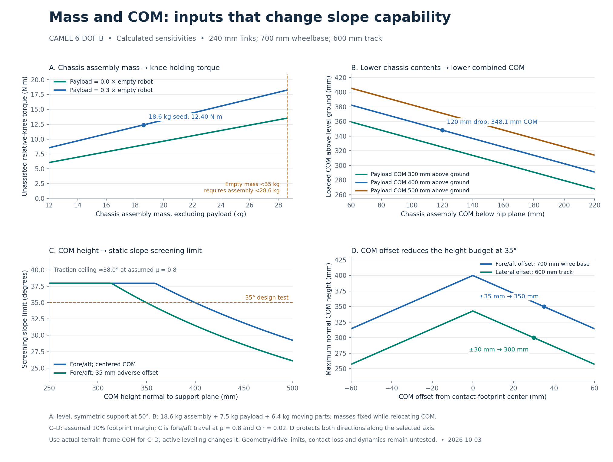
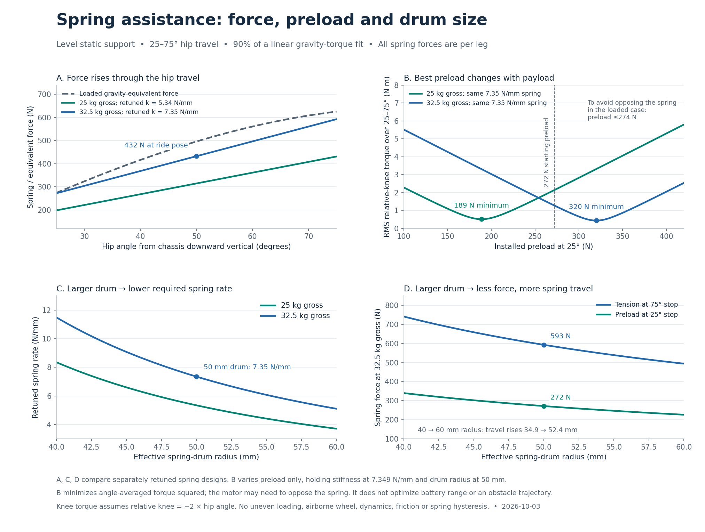
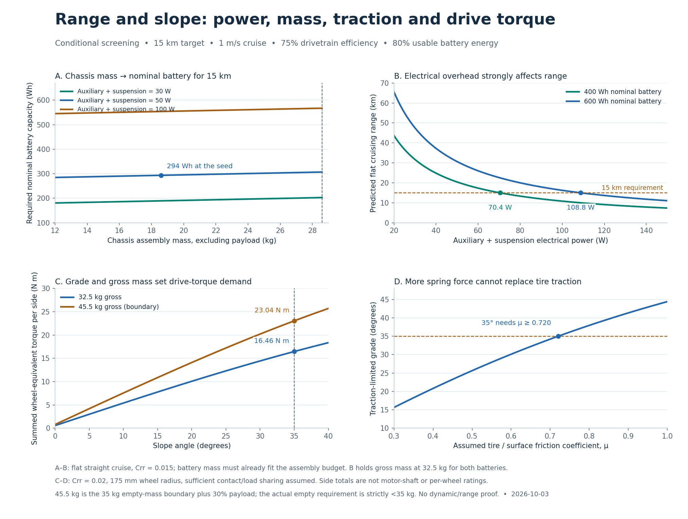

# How mass, COM and spring inputs affect the requirement outputs

[Main research record](README.md) · [Documentation map](../../README.md)

Prepared with Codex for Yulai Duan, 2026-10-03. Status: **preliminary analytical
sensitivities**, extending the retained geometry, spring, slope and range models.
These are calculated response curves, not measured correlations or a fitted
prediction of successful robot operation. All angles, masses and margins remain
proposed inputs unless identified as requirements.

## What the charts change about the starting inputs

| Input | Useful result for the simulation | Output affected |
| --- | --- | --- |
| Chassis assembly mass | Keep 18.6 kg as a seed; screen 12–28.6 kg for sensitivity. With 6.4 kg of moving parts, the strict <35 kg empty-mass requirement gives assembly <28.6 kg. No structural optimum is established. | Mass, knee torque, drive torque and range |
| Chassis assembly position | Lowering the 18.6 kg assembly COM by 40 mm lowers the 32.5 kg loaded COM by 22.9 mm. Check ground clearance and packaging. | Static slope margin |
| Loaded operational COM | At 35°, a 10% footprint reserve permits about 400 mm height when centered fore/aft, or 350 mm with a 35 mm adverse longitudinal offset. | Uphill/downhill stability |
| Lateral COM offset | The same 35°/10% screen permits 343 mm height when centered laterally, but only 300 mm with a 30 mm offset. | Side-slope stability; separate from the stated uphill slope requirement |
| Spring preload with k fixed at 7.349 N/mm | Expand the initial sweep to approximately 190–320 N. Include 255 N and the earlier 272 N seed; record when the motor must oppose the spring. | Angle-averaged knee torque; battery effect remains unmeasured |
| Force over the full spring travel | The loaded 90% fit has 272 N at 25°, 432 N at 50° and 593 N at 75°, with a 50 mm drum. | Spring sizing, cable/drum loads and residual joint torque |
| Effective spring drum radius | Sweep 40–60 mm. Larger radii lower force and required rate, but increase spring travel. | Spring package and force/stroke tradeoff |
| Electrical power besides propulsion | For the stated flat-cruise seed, 400 Wh allows at most 70.4 W and 600 Wh at most 108.8 W to reach 15 km. | Range; includes electronics and suspension electrical demand |
| Tire traction and side drive | The 35° seed needs μ ≥0.720 at Crr =0.02 and 16.46 N m summed wheel torque per side at 32.5 kg gross. | Slope traversal; COM and spring tuning alone cannot satisfy it |

All ranges are conditional. For example, the 350 mm COM seed and ±30 mm lateral
offset do **not** jointly retain the assumed 10% margin on a 35° side slope. If
both directions of side slope are required, move toward a centered COM below
343 mm, or below about 300 mm when allowing ±30 mm offset. These heights are
normal to the actual support plane, not necessarily the CAD world-Z height.

## 1. Chassis assembly, mass placement and slope margin



[Vector figure](assets/mass-com-relationships.svg)

The assembly contains the battery, chassis-mounted motors and electronics. Its
mass excludes the moving links, wheel assemblies and payload. The seed ledger is
18.6 + 6.4 =25 kg empty, plus 7.5 kg payload =32.5 kg gross. In the loaded mass
sweep, payload stays at 30% of empty mass, so one added chassis kilogram adds
1.3 kg to gross mass. This is a sensitivity assumption, not a prescribed payload.

Panel B holds all masses fixed while relocating the assembly COM. It uses a
483.5 mm hip height, uniform 0.35 kg links and 0.9 kg wheels. The 400 mm payload
COM and assembly COM 120 mm below the hips produce a 348.1 mm level-ground COM.
Moving the payload changes this result; adding low mass and relocating existing
mass are different operations.

For a planar footprint of length S along the slope, let x be the COM offset
uphill and h its height normal to the support plane. The uphill contact pair's
normal-load fraction is

\[
{N_\mathrm{up}\over Mg\cos\alpha}
=\frac12+\frac{x-h\tan\alpha}{S}.
\]

Requiring at least an **assumed 10%** fraction for the uphill contacts gives
\(h\le(0.4S+x)/\tan\alpha\). Protecting both directions at a fixed offset gives
\(h\le(0.4S-|x|)/\tan\alpha\), the inverted-V curves in panel D. Use S =700 mm
fore/aft or 600 mm laterally. A signed uphill shift improves one direction while
reducing the opposite direction's margin. Centered placement maximizes the worse
of the two directions under this symmetric footprint assumption.

Panel C combines the fore/aft static-margin limit with the assumed uphill
traction bound, \(\alpha\le\arctan(\mu-C_{rr})\), at μ =0.8 and Crr =0.02. Its
approximately 38° plateau shows why lowering COM eventually stops helping this
particular screen. Actual torque, geometric travel and contact constraints can
impose a lower limit. Active chassis levelling requires transforming the COM
and recomputing contact geometry; do not insert a level-CAD height unchanged.

## 2. Spring force, preload and motor torque



[Vector figure](assets/spring-relationships.svg)

The two force curves in panel A are **separately retuned springs** for 25 and
32.5 kg gross mass. Panel B instead keeps one spring rate fixed at 7.349 N/mm
and adjusts only its installed preload. This distinction matters: adjusting
preload does not change the physical spring rate.

For the circular hip drum, with θ in radians and k in N/m,

\[
F_s=F_0+kr_s(\theta-\theta_\min),\qquad
\tau_k={\tau_g-r_sF_s\over2}.
\]

The signed torque residual assumes the motor acts at the relative knee,
\(q_k=-2\theta\), as in the main research record. We minimize the mean of
\(\tau_k^2\) over 1001 uniformly spaced angles from 25° to 75°. At fixed k, this
is a convex quadratic in preload, with the exact minimum

\[
F_0^*=\operatorname{mean}_\theta
\left[\tau_g/r_s-kr_s(\theta-\theta_\min)\right].
\]

| Fixed 7.349 N/mm spring, 50 mm drum | Best preload for that stated objective | Result or condition |
| --- | --- | --- |
| 25 kg empty case | 189.0 N | RMS relative-knee torque 0.512 N m |
| 32.5 kg loaded case | 320.0 N | RMS relative-knee torque 0.433 N m |
| Equal weighting of empty and loaded cases | 254.5 N | Minimum of the average of their mean-square torques |
| Loaded case, additionally requiring nonnegative gravity-support torque throughout travel | 273.6 N | Constrained minimum; close to the earlier 272 N seed |

The 320 N solution makes the motor oppose the spring over part of the travel.
If that behavior is excluded, impose
\(F_0\le\min_\theta[\tau_g/r_s-kr_s(\theta-\theta_\min)]\). For the loaded case,
the bound is 273.6 N. This explains why the earlier 272 N starting point remains
useful despite not minimizing unconstrained RMS torque. In the empty case the
same no-reverse-torque bound is only 134.2 N: one fixed spring cannot satisfy all
load objectives equally well. A motor that can oppose the spring may accept
this tradeoff; the required direction and torque must be represented in the sim.

Use roughly 190, 200, 255, 272, 300 and 320 N as preload cases with the rate held
fixed, plus spring disabled. The no-reverse empty case at 134 N is a separate
comparison if that control constraint matters. These are static objectives, not
proven range optima or component ratings. Uneven support, free-wheel lifting,
accelerations, spring friction and damping are absent from the model.

For a fixed assist-torque curve, force scales as \(1/r_s\), rate as
\(1/r_s^2\), and spring travel as \(r_s\). Increasing drum radius from 40 to
60 mm reduces force to two thirds and rate to four ninths, while increasing
travel from 34.9 to 52.4 mm. The spring drum and the hip/knee coupling pulleys
are distinct components.

The fit method is supported by [Belov et al.](https://arxiv.org/html/2411.18295v1),
which optimizes spring parameters using torque and angle histories. Our histories
here are derived static loads. A mission-based fit should use measured or
simulated time histories. [Bjelonic et al.](https://arxiv.org/html/2301.03509v1)
measured a 33% improvement in their torque-square metric and 11% longer operation
on their ANYmal configuration; these different percentages illustrate why CAMEL
must measure total electrical energy separately. Neither paper establishes our
specific preload or COM values.

## 3. Range, drive torque and traction



[Vector figure](assets/range-drive-relationships.svg)

For level straight travel, the energy model is

\[
e={C_{rr}Mg/\eta_d+P/v\over3.6}\ \mathrm{Wh/km},\quad
R={fE_\mathrm{nominal}\over e},\quad
E_\mathrm{nominal,15km}={15e\over f}.
\]

The figure uses η_d =0.75, f =0.80, v =1 m/s and Crr =0.015. P includes auxiliary
and suspension electrical demand beyond propulsion. At these assumptions,
adding 1 kg to the assembly while maintaining a 30% payload ratio adds only
1.33 Wh to the nominal 15 km battery requirement. An extra 10 W of sustained
electrical demand adds 52.1 Wh nominal capacity, or 41.7 Wh actually consumed.
This comparison holds the efficiencies and P fixed; heavier hardware may also
increase suspension power, impacts and turning losses, which are not included.

The 400/600 Wh range curves hold gross mass at 32.5 kg. They are power-budget
screens, not a claim that either battery fits the mass budget. Battery assembly
mass must be included once, inside the chassis ledger. Verify electronics power,
holding losses, drive efficiency and tire losses before expecting these ranges.

For slopes the separate force balance is

\[
\tau_\mathrm{side}={Mg(\sin\alpha+C_{rr}\cos\alpha)r_w\over2},\qquad
\mu\ge\tan\alpha+C_{rr}.
\]

At 35°, with Crr =0.02 and 175 mm wheel radius, the loaded seed needs 16.46 N m
wheel-equivalent torque per side. The 45.5 kg gross boundary needs 23.04 N m.
Convert these to motor-shaft torque using the actual reduction and efficiency,
and retain speed/thermal reserve. The requirement is strictly <35 kg empty;
the boundary case does not itself pass it.

Wheel mass also affects this ledger and transient inertia. Adding 0.5 kg to each
wheel adds about 2.18 Wh consumed over 15 km at Crr =0.02 and η_d =0.75, before
acceleration, deformation, contact and steering effects. The earlier 0.7–1.2 kg
wheel interval remains an assembly budget, not a vendor-validated optimum.

## What still needs a full robot model

These curves do not predict successful step height from spring force. A 150 mm
step needs the [link-travel screen](README.md#link-length-and-usable-obstacle-travel)
plus contact sequencing, support loads, traction, body clearance and motor limits.
Spring rate/preload do not establish damping or contact retention. The present
curves also do not prove width, folded volume, cost or teleoperation range.

The next useful simulation outputs are: 150 mm step completion; 32°/35° grade
completion; minimum contact-load/stability margin; peak and RMS motor torque;
slip; body acceleration; and total electrical Wh/km. Sweep the inputs together,
reject failed requirements, then fit a response model to successful simulations
and verify any suggested optimum in fresh runs.

## Reproduction and checks

Use the [standalone plot/calculation script](../../../database/code_prototypes/plot_parameter_relationships.py)
with Python 3.11.16, NumPy 2.4.6 and Matplotlib 3.10.7 in a plotting environment:

```sh
python database/code_prototypes/plot_parameter_relationships.py --output simulation/results/parameter-relationships
```

Retained evidence: [5,826 curve samples](assets/parameter-relationships.csv) and
[provenance, source/script hashes and numerical checks](assets/parameter-relationships.json).
The script reproduces five retained 90%-assist fits, all eight slope torque rows
and all five energy rows to within 1e-10 in their respective column units. A
separate force/moment solve at the four COM boundaries reproduces the 10% normal
load fraction within 1.2e-16. It also checks the preload minima, the sign-reversal
bounds and the mass-weighted COM displacement. PNG figures are visually inspected.
These checks establish implementation agreement, not hardware validity.
