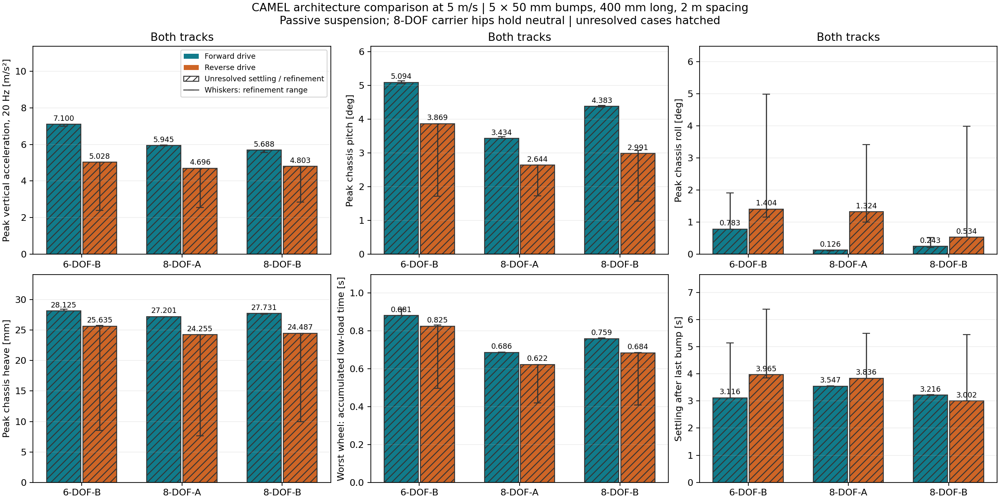
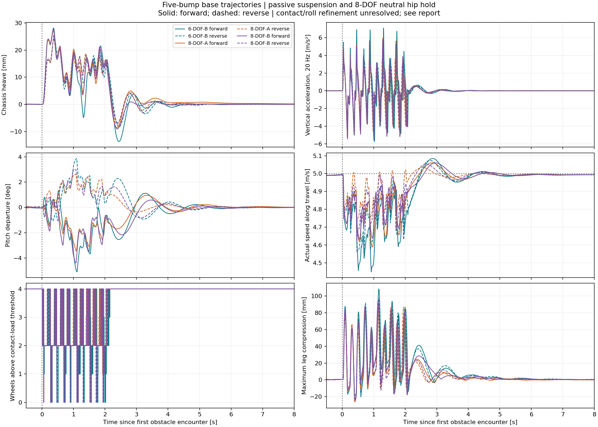
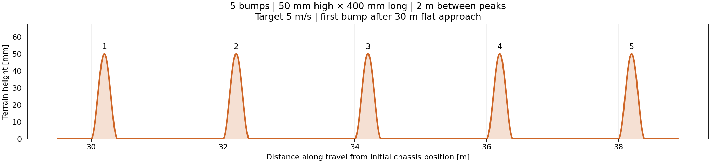
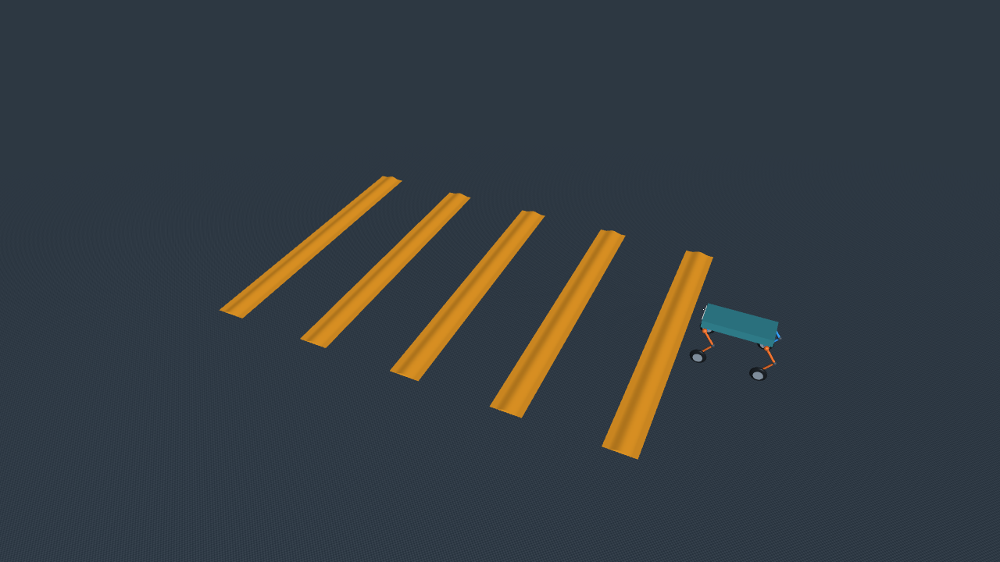

# CAMEL five-bump simulation results

Prepared with Codex for Yulai Duan, 2026-10-06. Status: preliminary numerical
evidence using assumed geometry, masses, springs and tire contact. These results
identify candidates for further investigation; they do not validate hardware or
establish a final architecture choice.

## Test conditions

- Five raised-cosine bumps, each **50 mm high and 400 mm long**.
- **2 m peak spacing**, with 1.6 m flat gaps; a 6 m-wide road covers both tracks.
- **5 m/s target speed**, following a 30 m flat approach to reduce startup motion.
- 6-DOF-B, 8-DOF-A and 8-DOF-B, each forward and reverse: six base runs and
  18 timestep/terrain refinements.
- Mass 13.822 kg; 340 mm equal links; 150 mm wheel radius; nominal leg extension
  550 mm; spring stiffness 40 N m/rad and assumed damping 1.5 N m s/rad per leg.
- Front/rear spring preloads 9.2861/10.2924 N m, held fixed across directions.
  Suspension motors are unpowered. 8DOF carrier hips hold neutral with bounded
  control; 6B carriers are fixed. All variants have the same assumed total mass.
- Drive torque is bounded at 6 N m per shared side shaft. Base timestep 0.25 ms;
  terrain spacing 2.5 mm. Python 3.11.16, MuJoCo 3.14.0 and NumPy 2.4.6, CPU.

Forward means knees point rearward relative to travel; reverse means knees point
forward. 8A has paired front/rear carrier pitch; 8B has independent front carrier
pitch. All four coupled legs share the same knee orientation.

## Base-run results

Acceleration is world-frame chassis COM acceleration filtered at 20 Hz.
Pitch is the maximum absolute departure from settled standing attitude.
Unloading is the worst wheel's accumulated time below 1% of nominal static
corner load, including no-contact intervals; it is not one continuous airborne event.

| Configuration | Drive | Crossing mean (m/s) | Peak acceleration (m/s²) | Peak pitch (deg) | Worst-wheel unloading (s) |
| --- | --- | ---: | ---: | ---: | ---: |
| 6-DOF-B | Forward | 4.714 | 7.100 | 5.094 | 0.881 |
| 6-DOF-B | Reverse | 4.765 | 5.028 | 3.869 | 0.825 |
| 8-DOF-A | Forward | 4.783 | 5.945 | 3.434 | 0.686 |
| 8-DOF-A | Reverse | 4.873 | 4.696 | 2.644 | 0.622 |
| 8-DOF-B | Forward | 4.809 | 5.688 | 4.383 | 0.759 |
| 8-DOF-B | Reverse | 4.830 | 4.803 | 2.991 | 0.684 |

Approach speeds were 4.990–4.992 m/s. All 24 crossings finished and settled
without bottoming, tipping, stalling, leaving the road, hip saturation or numerical
warnings. Every crossing experienced wheel unloading. Base heave peaked at
24–28 mm and maximum leg compression at 86–109 mm.

## Interpretation

**8-DOF-A forward is the most promising balanced candidate for the next study.**
Relative to 6B forward, its base peak acceleration is 16.3% lower, pitch is 32.6%
lower and worst-wheel accumulated unloading is 22.1% lower. 8B forward has the
lowest forward acceleration, but more pitch and unloading than 8A.

Reverse gives lower base acceleration and pitch for all three architectures.
However, numerical refinement changes reverse peak acceleration by up to 52.2%
and produces roll of 3.41–4.98 degrees. A knee-forward direction preference is
therefore **unresolved**. The earlier narrow-road pilot partly missed later bumps;
the final wide road removes that confound but does not resolve contact sensitivity.

Only **4/18 complete refinement comparisons pass**, and no configuration passes
all three. All six base runs exceed the existing 0.05-degree symmetric-roll
criterion. Forward 8A chassis metrics pass all refinements, but its combined
refinement changes peak wheel load by 12.4%, exceeding the 10% criterion.
Graph hatching marks unresolved cases; whiskers are numerical sensitivity ranges,
not confidence intervals. The retained report preserves `all_passed=false`.

Next characterize tire/contact behavior and symmetric roll, update measured mass
properties and dimensions, then repeat convergence and matched active-control
tests. Identical mass and neutral hip holding do not assess added actuator mass,
energy consumption or optimized active suspension.

## Evidence and availability

[CSV](architectures.csv) and [JSON](architectures.json) preserve measurements,
all refinements, resolved configurations, model/source hashes, runtime provenance,
33 passing local regression checks and the unresolved findings. The complete
simulation implementation is at local commit `0124164`; it has not been published
because canonical-robot validation is blocked. This results-only publication
does not include executable simulation code or claim fresh simulation validation.
Reproduction requires that local implementation and the retained resolved configs;
the current public checkout alone cannot rerun this experiment.

A separate 17-second, 1080p H.264 MP4 shows the six base runs at 0.5x playback.
All six video replays exactly match the study's model hashes and complete response
summaries. Video and raw histories remain local artifacts; the static layout above
is an illustrative pose, not a frame of a recorded crossing.
