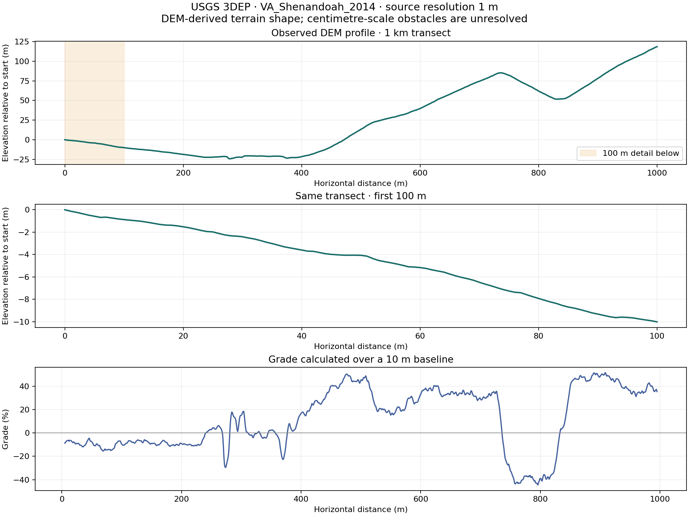
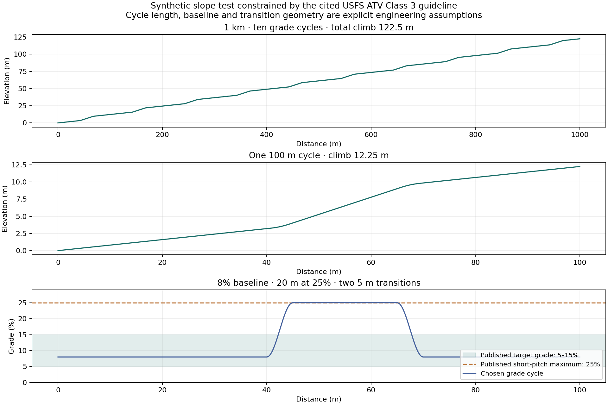
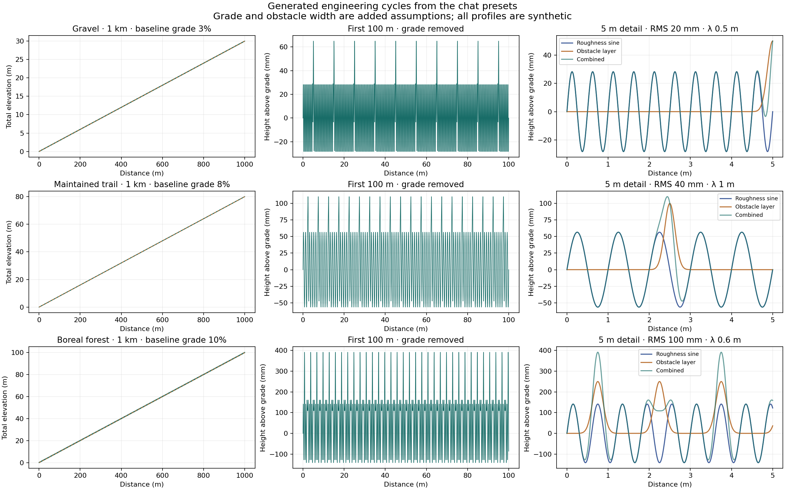

# Terrain data and profile specification

This supplement makes the terrain layer of the Capstone design tool traceable from a named terrain archetype to numerical parameters, a height-versus-distance profile, and engineering tests at 100 m and 1 km. It distinguishes observed terrain, published design guidelines, synthesized envelopes, and generated test inputs. The files and plots below were prepared on October 2, 2026.

The main finding is that **Terrain Variability Studies supplies usable test presets, but does not contain measured biome-wide profiles**. The associated Specs page explicitly labels its terrain ranges as synthesized design envelopes. Preserve those values and labels. Add measured profiles as an independent evidence path; do not relabel the old biome ranges as measurements.

## Evidence paths

| Evidence type | What we have now | Supported use |
| --- | --- | --- |
| Observed DEM-derived data | A retrieved 1 km USGS 3DEP transect, sampled at 1 m, plus its first 100 m | Local elevation and grade at the source scale |
| Published design guideline | Visually verified USFS ATV design parameters | Controlled grade, obstacle and width benchmark cases |
| Synthesized design envelope | Eleven terrain archetypes from the Specs page | Declared engineering test ranges |
| Illustrative design preset | Seven cycle presets from Terrain Variability Studies | Reproducible periodic comparisons; selected defaults |
| Added modeling assumption | Grade chosen for an example, obstacle width and shape, spectral approximation | Complete a test case while exposing what remains unmeasured |

Assign evidence at the parameter level. A profile can combine a measured slope baseline with assumed wheel-scale roughness, but it must then be labeled a hybrid. Its measured component does not validate the assumptions.

## Original terrain archetypes

The following values were pulled from [Specs — Terrain / Mobility](https://app.notion.com/p/3ebb26c7416c801aa3acd33e730cba0c), referenced by [Terrain Variability Studies](https://chatgpt.com/c/6abb5d6d-029c-83ea-8d0d-cab0e6a3ef19). All rows are **synthesized design envelopes**. Units and qualitative gaps are preserved. Neither the roughness wavelength band nor the detrending convention was specified for this table.

| Terrain archetype | Grade | Cross-slope | Roughness | Obstacles | Corridor | Surface |
| --- | --- | --- | --- | --- | --- | --- |
| Improved road | 0–7% | <5% | 2–10 mm RMS | <25 mm, rare | >3 m | Hard |
| Gravel / service road | 0–15% | <8% | 8–30 mm RMS | 25–75 mm, sparse | >2 m | Hard / loose |
| Maintained natural trail | 5–15% | <10% | 25–80 mm RMS | 50–150 mm, ~2–5 m spacing | ~1.2–2 m | Mixed |
| Primitive trail | 10–25% | <15% | 40–120 mm RMS | 100–300 mm, ~1–3 m spacing | ~0.8–1.5 m | Mixed |
| Canadian Shield / boreal rough trail | up to ~25% | up to ~20% | ~70–120 mm RMS | 150–300 mm roots/rock | ~0.8–1.5 m | Hard / mixed |
| Wet forest / Amazon-style | ~10–20% | ~10–15% | ~50–100 mm RMS | 150–300 mm roots/logs | ~0.6–1.2 m | Soft / mixed |
| Grassland / open field | ~0–15% | ~0–10% | ~20–80 mm RMS | 50–200 mm, sparse | Open | Mixed |
| Sand / dunes | ~5–15° normal, ~30° slip face | low–moderate | low small-scale roughness | usually small | Open | Loose |
| Tundra / muskeg | usually low | usually low | ~30–100 mm RMS | 100–300 mm hummocks | Open | Soft |
| Alpine / scree | ~10–30%+ | ~10–25% | ~80–150+ mm RMS | 200–400+ mm, dense | ~0.5–1.5 m | Loose / rock |
| Talus / boulder field | ~10–30%+ | ~15–30% | ~100–250+ mm RMS | 200–600+ mm, dense | Variable | Hard / loose |

The machine-readable extraction is [terrain-archetypes.json](../data/terrain/terrain-archetypes.json). “Sparse,” “rare,” “dense,” and “usually low” remain qualitative. They are not silently converted to numerical spacing or grade distributions.

Biome and surface names provide context. Soil strength, friction, rolling resistance, vegetation confinement and land-cover category require their own evidence. A forest label does not establish root height, and an alpine label does not establish one RMS or wavelength.

## Verified trail benchmark values

The earlier chat cites [Designing Sustainable Off-Highway Vehicle Trails](https://www.fs.usda.gov/eng/pubs/pdfpubs/pdf11232804/pdf11232804dpi100.pdf), revised November 2013. Figure 4-4 on printed page 14, PDF page 22, reproduces ATV design parameters from the October 16, 2008 Forest Service handbook. I downloaded the original PDF and inspected the rendered table. These are the historical design guidelines cited by the chat, not a claim that every present-day trail meets them.

| ATV class | Target grade | Short pitch maximum | Maximum obstacle | Maximum protrusion | Single lane tread width |
| --- | --- | --- | --- | --- | --- |
| 2 moderately developed | 10–25% | 35% | 304.8 mm | 152.4 mm | 1.219–1.524 m |
| 3 developed | 5–15% | 25% | 152.4 mm | 76.2 mm | 1.524 m |
| 4 highly developed | 3–10% | 15% | 76.2 mm | 76.2 mm | 1.524–1.829 m |

The table also supplies maximum pitch density ranges of 20–40%, 15–30% and 10–20% of trail length for Classes 2, 3 and 4 respectively. These are design fractions. They do not provide a measured sequence of hills, the length of an individual pitch, obstacle spacing, RMS roughness or roughness wavelength.

The old shorthand “primitive Class 2” should be interpreted carefully: the cited guide calls Class 2 **moderately developed**. Tread width is also different from the clear corridor width used in the biome table.

See [verified benchmark JSON](../data/terrain/usfs-trail-benchmarks.json), [original PDF (archived)](../../capstone-archive/README.md), and [rendered source table (archived)](../../capstone-archive/README.md). Unit conversions use exactly 25.4 mm per inch.

## Real elevation example

A source-locked request to the [USGS 3DEP elevation service](https://elevation.nationalmap.gov/arcgis/rest/services/3DEPElevation/ImageServer) returned data from **VA_Shenandoah_2014**, source raster 75304, a 1 m bare-earth DEM in NAVD 88. The service is multi-resolution; locking the source avoids silently mixing DEM resolutions along the example.

The example is a straight northward transect from longitude −78.35°, latitude 38.60°, to latitude 38.6090083641°. It is an illustrative off-road line in the Shenandoah area of Virginia. It is not a mapped hiking route, and no biome or land-cover classification was verified for the line.

| Retrieved or calculated quantity | Value |
| --- | --- |
| Horizontal transect length | 1,000 m |
| Samples | 1,001 |
| Sampling interval and reported source resolution | 1 m |
| Net elevation change | +118.392 m |
| Elevation range | 142.597 m |
| 5th to 95th percentile longitudinal grade over 10 m baselines | −37.267% to +47.782% |
| Source project | VA_Shenandoah_2014 |
| Vertical datum | NAVD 88 |
| Source-specific vertical accuracy | Not established in this extraction |

Grades use centred 10 m differences; the first and last 5 m have no centred grade estimate. Horizontal distance follows the WGS84 meridional arc, integrated numerically. Elevations are bilinear samples of the DEM, rather than direct point-cloud returns.

Files: [1 km CSV](../data/terrain/usgs-shenandoah-transect-1000m.csv), [100 m CSV](../data/terrain/usgs-shenandoah-transect-100m.csv), and [source and processing metadata](../data/terrain/usgs-shenandoah-provenance.json). Original service responses and exact request parameters are retained under data/terrain/sources.



This provides real local topography. It does not validate 50–300 mm root or rock geometry, fine-scale suspension roughness, cross-slope, surface mechanics, or an entire biome's statistical distribution. A 1 m DEM cannot be treated as centimetre-resolution terrain merely by interpolating more samples. For the wheel-scale layer, obtain surveyed profiles, suitable local scans, or ground returns with appropriate point density and documented error.

## Mapping parameters to a periodic test

Use three independent geometric layers:

```text
z(x) = macro elevation or slope baseline
     + continuous roughness
     + discrete obstacles
```

For the simplest periodic roughness input:

```text
roughness(x) = A sin(2πx / λ)
A = sqrt(2) × specified RMS
cycles across a length L = L / λ
excitation frequency at constant speed v = v / λ
```

RMS is calculated about the sine component's mean and excludes grade and obstacle layers. At finite lengths that do not contain an integer number of cycles, report realized RMS as well as the requested value. The sine amplitude is its zero-to-peak height, not RMS.

The following are the exact illustrative cycle defaults from the chat, not measured universal averages:

| Chat preset | Roughness RMS | Roughness wavelength | Obstacle layer height | Obstacle spacing |
| --- | --- | --- | --- | --- |
| Road | 5 mm | 3 m | 10 mm | 50 m |
| Gravel | 20 mm | 0.5 m | 50 mm | 10 m |
| Maintained trail | 40 mm | 1 m | 100 mm | 5 m |
| Primitive trail | 80 mm | 0.7 m | 200 mm | 2 m |
| Boreal forest | 100 mm | 0.6 m | 250 mm | 1.5 m |
| Alpine | 130 mm | 0.5 m | 300 mm | 1 m |
| Talus | 200 mm | 0.4 m | 400 mm | 0.5 m |

Roughness wavelength, correlation length and obstacle spacing are different parameters. A random process with a correlation length does not necessarily have one periodic wavelength. A single sine is an engineering comparison test that concentrates roughness at one frequency; it is not a complete PSD representation of natural terrain.

For the maintained-trail test, 40 mm RMS gives **56.57 mm sine peak amplitude**, a 1 m wavelength gives **100 cycles over 100 m** and **1,000 cycles over 1 km**, and 5 m obstacle spacing gives **20 or 200 obstacle events**. At 1 m/s, the roughness excitation is 1 Hz and obstacle arrivals are 0.2 Hz.

The illustrative 8% baseline grade gives a net climb of 8 m over 100 m or 80 m over 1 km. That baseline grade is a separate chosen test point within the envelope. It is not the maximum instantaneous slope of the roughness and obstacle surface. When layers overlap, total terrain height can exceed an individual obstacle-layer height.

## A slope cycle tied to a published guideline

A separate generated slope example uses the cited ATV Class 3 guideline: 5–15% target grade, 25% short-pitch maximum and 15–30% maximum pitch density. Choose an 8% baseline and a 100 m grade cycle with 20 m at 25%, plus a 5 m smooth transition at each end. The cycle length, baseline and transitions are modeling assumptions; the published guideline provides constraints rather than a measured repeating pattern.

This produces 12.25 m climb per 100 m cycle, a mean grade of 12.25%, and 122.5 m climb over ten cycles in 1 km. The maximum-grade plateau occupies 20% of each cycle. **The grade pattern repeats; elevation continues accumulating.** Resetting elevation after 100 m would create an artificial cliff.

See the [100 m slope-cycle CSV](../data/terrain/synthetic-class3-slope-cycle-100m.csv), [1 km CSV](../data/terrain/synthetic-class3-slope-cycle-1000m.csv), and [parameter evidence](../data/terrain/synthetic-class3-slope-cycle-provenance.json).



## Example profiles already generated

Three examples are saved: gravel, maintained trail and boreal forest. Each has 100 m and 1 km CSVs sampled every 10 mm, separate grade/roughness/obstacle columns, and its own metadata JSON. The grade choices of 3%, 8% and 10% and a Gaussian obstacle width of 0.30 m at half maximum are explicitly added assumptions. The obstacle width is not supplied by the cited table or chat defaults.

These generated cases use regular sine roughness and evenly spaced Gaussian obstacles. A future random mode must be labeled separately and use documented distributions, spatial correlation and a stored seed. No stochastic biome distribution was fitted during this extraction.



Use 1 km views to show slope, changing sections and total elevation; 100 m views to show roughness and obstacle density after removing the baseline; and 5–10 m views to expose individual cycles and obstacle shapes. Export all samples even when plots are simplified. Preserve extremes when reducing data for display.

For stochastic cases generate one master 1 km realization, then crop its first 100 m. Generating each length independently or normalizing it separately would change the terrain being compared. Increasing length does not mean repeating a 100 m block ten times unless a repeated-block stress test is explicitly selected.

## Data-driven behavior required in the tool

The terrain controls should display the selected terrain record and a per-parameter evidence badge, source link, numerical range, selected value, units, resolution or scale, and added assumptions. The process should be visible:

**Selected terrain context → source parameters → chosen test realization → verified profile statistics → dynamics.**

Support four profile modes:

1. **Observed profile:** replay the measured or DEM-derived line at its valid scale.
2. **Periodic engineering cycle:** a sine or repeated obstacle with explicitly chosen amplitude and wavelength.
3. **Stochastic engineering scenario:** correlated roughness and obstacle distributions, with source-backed values where available.
4. **Hybrid:** measured macro slope plus separately identified synthetic fine terrain.

For each mode report requested versus realized grade, detrended RMS over a declared wavelength band and window, obstacle-layer event count and prominence, slope extremes with a specified baseline, seed, source and processing steps. Missing parameters require a disclosed assumption or remain unknown.

A roughness value cannot be compared across a 100 m and 1 km line without specifying detrending and wavelength band. Whole-route elevation RMS includes hills and is not the millimetre roughness used for suspension tests. Keep macro elevation, metre-scale undulations, sub-metre roughness, and discrete obstacles separately selectable. The appropriate scales depend on source resolution and wheel geometry.

The short-pitch fraction from a trail design guideline can constrain a synthetic route composition, but the exact number, length and spacing of slopes still require assumptions or measurement. A 1 km route might consist of varying grades and obstacles; it does not follow from “boreal” that the full kilometre has one constant 10% grade.

## Development stages

**Version 1:** import source records, preserve evidence labels, support 100 m and 1 km profiles, expose periodic cycles and separate layers, validate realized statistics, and export metadata with the terrain.

**Version 2:** calibrate wavelength/correlation and obstacle distributions from suitable measured profiles; create segmented routes; compare synthetic and measured statistics at matching scales; add paired tracks for later asymmetric vehicle tests.

**Version 3:** expand multiple sites per terrain family, attach land-cover/biome context from verified sources, model uncertainty and seasonal effects where supported, and evaluate performance on held-out measured terrain. Passing a designed test set is not a world-biome coverage probability.

## Source interpretation and verification

The accessible [SAE paper abstract](https://saemobilus.sae.org/papers/terrain-roughness-standards-mobility-ultra-reliability-prediction-2003-01-0218) supports using elevation RMS and PSD to characterize vehicle test roughness; it does not supply the biome table's numerical values. The [ISO 8608 scope](https://www.iso.org/standard/71202.html) covers reporting measured road and off-road vertical profiles; its public summary does not provide biome calibration. [NIST stepfields](https://www.nist.gov/publications/stepfield-pallets-repeatable-terrain-evaluating-robot-mobility) support reproducible constructed mobility challenges, not natural biome frequencies.

The current evidence package contains one observed DEM transect, historical published trail-design benchmarks, and declared engineering presets. It does not yet contain measured centimetre-scale terrain distributions for the eleven archetypes. That gap is visible in the metadata and must remain visible in the tool.

The [retrieval and plot script](../scripts/build_terrain_evidence.py) caches raw service responses, checks sample locations, source resolution, missing values and geodesic distances, and regenerates the CSVs and figures. The source table was inspected visually. The figures were inspected for units, scales, legends and evidence labels.
