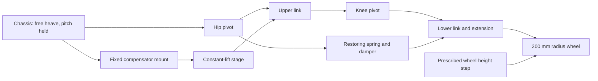

# Constant-lift wheel-leg suspension

Owner: Andy Zhang. Updated: 2026-10-10. Status: editable experimental architecture,
requested as the existing 2:1 folding leg with a restoring spring and damper.
It is not a hardware selection or canonical vehicle model.

Open [the complete suspension](http://127.0.0.1:4186/?tab=physics&architecture=constant-lift)
after starting **Start Motion Lab.cmd**. The constant-lift lever's **Use in
wheel-leg suspension** button and main/Physical menus open this same model.
The cold entry loads one architecture profile without first running defaults.

## Two passive stages

The floating chassis carries two spring paths on the original guided wheel leg.
The wheel radius is 200 mm; each link is 273 mm and the lower link extends 50 mm
past the knee. Dimensions, masses and rates remain editable demo values.

| Stage | Connection | Purpose and demo settings |
| --- | --- | --- |
| Gravity compensator | Chassis mount 150 mm below the hip to an upper-link point 136.5 mm from the hip | Zero effective free length, positive physical coil free length 230 mm; calibrated rate about 2260.04 N/m; primary damping zero |
| Ride spring and damper | Hip to the original lower-link extension tip | Captured bilateral spring, 8000 N/m and 500 N s/m; automatic free length about 277.5 mm gives zero initial elastic force |

The compensator supplies about 84.75164 N of **equivalent shape support** for
the stated chassis/link weights. The ride stage returns the relative leg pose
toward its initial 45° setting and dissipates motion energy. The default knee
controller is disabled; no hidden actuator holds the ride height. Both springs'
forces, elastic/damper components, energies and combined support are reported.



The mount and lever arm belong to the actual rigid bodies; a visible bracket
shows the chassis connection. Spring paths are ideal massless mechanisms.
The native viewer draws four actual engine shapes, including the chassis sensor
polygon, and six actual constraints. Coil/routing overlays are labeled and do
not pretend to be collision geometry.

## Restoring behavior

For theta from horizontal, chassis height relative to the wheel is
`h=2L sin(theta)`. The auxiliary tip span follows

```text
s(theta) = sqrt(L² + e² + 2Le cos(2theta))
s_ref = s(theta_initial)
T_ride = k_ride (s - s_ref) + c_ride ds/dt
Q_ride = -T_ride ds/dtheta
```

The captured law acts in either direction. With automatic reference length,
elastic force is zero at the initial pose and opposes motion to either side.
At that pose, effective vertical stiffness is
`k_ride (ds/dtheta)² / (dh/dtheta)²`, rather than the raw coil rate. Compression-
or extension-only behavior is selectable and can leave one side slack.

Gravity-stage calibration carries the declared gravitational shape load.
Manually preloading the ride spring can shift equilibrium; it is not silently
subtracted from the compensator. Turning the ride stage off restores the earlier
neutral compensation model.

## Solvers and records

The [factory](../suspension_architecture.py) serves
`GET /api/suspension-architecture/defaults`. Both solvers accept its flat profile.
SciPy adds both spring generalized forces/energies to its independent equation.
Pymunk applies both point-force pairs to actual bodies before stepping; inverse
pin/torque checks include their combined loads. Per-stage loads remain separate.

JSON retains `aux_spring_enabled`, `aux_stiffness`, `aux_damping`, `aux_mode`,
`aux_rest_length` and `aux_auto_rest`. Full runs retain both geometry paths and
all samples. Plotly provides 15 architecture charts; disabling the ride stage
returns to the compensator's 12 charts. Native launch uses the visible model's
profile even when another Math/Misc/recorded frame holds different settings.

Eight dedicated tests pass for equilibrium, restoring signs, damping, actual
load closure, sensor mass/inertia, energy and refinement. All 90 Python tests
pass; the nine auxiliary-disabled preset trajectories remain unchanged.
Browser checks pass the deep entry, lever bridge, JSON/library-to-math flow,
actual chassis/dual coils, Plotly, native routing, dark mode and mobile.
See [validation](validation.md) for accuracy and native-window evidence.

The wheel-height fixture remains bilateral and chassis pitch is held. Tire
contact, full vehicle motion, real packaging, clearance, friction and hardware
durability are not established. MATLAB rejects the two-stage architecture;
use SciPy/Pymunk.
